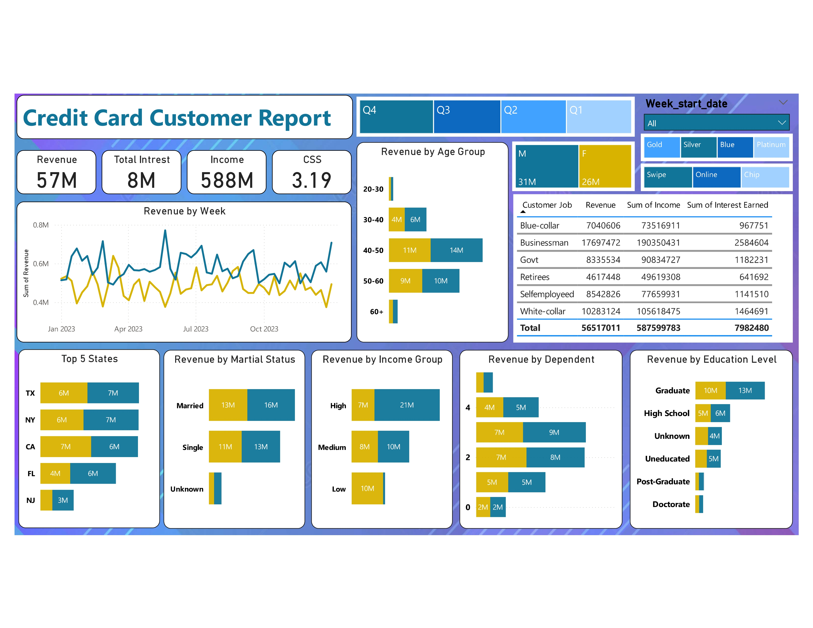

# 💳 Credit Card Financial Weekly Dashboard

## 🗂 Introduction
This Power BI dashboard provides real-time insights into key performance metrics and trends related to credit card transactions. It enables stakeholders to monitor and analyze financial operations effectively.

### 📌 Dataset Overview
The dataset contains details on:
- **Client Details**: Age, Gender, Income, Customer Satisfaction Score
- **Credit Card Transactions**: Transaction Amount, Credit Limit, Total Revolving Balance
- **Account Metrics**: Activation Rate, Delinquency Rate, Annual Fees, Interest Earned
- **Geographical Data**: State, Zip Code, House & Car Ownership

---

## 🔢 SQL Queries

### Creating the Database
Creates a new database `ccdb` to store credit card transaction data.
```SQL
CREATE DATABASE ccdb;
```

### Creating the Credit Card Transactions Table
Defines the `cc_detail` table, which stores transaction details such as fees, credit limits, and balances.
```SQL
CREATE TABLE cc_detail (
    Client_Num INT,
    Card_Category VARCHAR(20),
    Annual_Fees INT,
    Activation_30_Days INT,
    Customer_Acq_Cost INT,
    Week_Start_Date DATE,
    Week_Num VARCHAR(20),
    Qtr VARCHAR(10),
    current_year INT,
    Credit_Limit DECIMAL(10,2),
    Total_Revolving_Bal INT,
    Total_Trans_Amt INT,
    Total_Trans_Ct INT,
    Avg_Utilization_Ratio DECIMAL(10,3),
    Use_Chip VARCHAR(10),
    Exp_Type VARCHAR(50),
    Interest_Earned DECIMAL(10,3),
    Delinquent_Acc VARCHAR(5)
);
```

### Creating the Customer Details Table
Defines the `cust_detail` table, which stores customer demographic and financial details.
```SQL
CREATE TABLE cust_detail (
    Client_Num INT,
    Customer_Age INT,
    Gender VARCHAR(5),
    Dependent_Count INT,
    Education_Level VARCHAR(50),
    Marital_Status VARCHAR(20),
    State_cd VARCHAR(50),
    Zipcode VARCHAR(20),
    Car_Owner VARCHAR(5),
    House_Owner VARCHAR(5),
    Personal_Loan VARCHAR(5),
    Contact VARCHAR(50),
    Customer_Job VARCHAR(50),
    Income INT,
    Cust_Satisfaction_Score INT
);
```

### Importing Data into SQL Tables
Loads initial transaction and customer data from CSV files.
```SQL
COPY cc_detail FROM 'credit_card.csv' DELIMITER ',' CSV HEADER;
COPY cust_detail FROM 'customer.csv' DELIMITER ',' CSV HEADER;
```

Loads additional weekly transaction data into the database.
```SQL
COPY cc_detail FROM 'cc_add.csv' DELIMITER ',' CSV HEADER;
COPY cust_detail FROM 'cust_add.csv' DELIMITER ',' CSV HEADER;
```

---
## 📊 Dashboard Breakdown
The Power BI dashboard consists of:
1. **Total Revenue & Transactions** - KPI cards displaying financial metrics
2. **Week-over-Week Change** - Visuals tracking revenue fluctuations
3. **Customer Segmentation** - Analysis by age, income group, and region
4. **Activation & Delinquency Rates** - Financial risk assessment
5. **Top & Bottom Performing Credit Cards** - Breakdown by card category

---
## 📊 DAX Queries Used

### Categorizing Customers by Age
Categorizes customers into age groups for segmentation analysis.
```DAX
AgeGroup = SWITCH(
    TRUE(),
    'public cust_detail'[customer_age] < 30, "20-30",
    'public cust_detail'[customer_age] >= 30 && 'public cust_detail'[customer_age] < 40, "30-40", 
    'public cust_detail'[customer_age] >= 40 && 'public cust_detail'[customer_age] < 50, "40-50", 
    'public cust_detail'[customer_age] >= 50 && 'public cust_detail'[customer_age] < 60, "50-60", 
    'public cust_detail'[customer_age] >= 60, "60+",
    "Unknown"
)
```

### Categorizing Customers by Income
Classifies customers into income groups to assess spending patterns.
```DAX
IncomeGroup = SWITCH(
    TRUE(),
    'public cust_detail'[income] < 35000, "Low",
    'public cust_detail'[income] >= 35000 && 'public cust_detail'[income] < 70000, "Med", 
    'public cust_detail'[income] >= 70000, "High",
    "Unknown"
)
```

### Extracting the Week Number from Date
Extracts the week number from the `week_start_date` field for trend analysis.
```DAX
week_num2 = WEEKNUM('public cc_detail'[week_start_date])
```

### Calculating Total Revenue
Calculates total revenue by summing up annual fees, transaction amounts, and interest earned.
```DAX
Revenue = 'public cc_detail'[annual_fees] + 'public cc_detail'[total_trans_amt] + 'public cc_detail'[interest_earned]
```

### Computing Revenue for the Current Week
Computes the revenue for the most recent week using a filter on the maximum `week_num2`.
```DAX
Current_week_Revenue = CALCULATE( 
    SUM('public cc_detail'[Revenue]), 
    FILTER(
        ALL('public cc_detail'),
        'public cc_detail'[week_num2] = MAX('public cc_detail'[week_num2])
    )
)
```

### Computing Revenue for the Previous Week
Calculates revenue for the previous week for comparison and performance tracking.
```DAX
Previous_week_Revenue = CALCULATE( 
    SUM('public cc_detail'[Revenue]), 
    FILTER(
        ALL('public cc_detail'),
        'public cc_detail'[week_num2] = MAX('public cc_detail'[week_num2]) - 1
    )
)
```
### Customer Report

### Transaction Report


## 📈 Key Insights
- **Revenue Growth**: Increased by **28.8% WoW**
- **Total Transactions**: Up **35% WoW**, with a **12.8% customer increase**
- **Year-to-Date (YTD) Metrics**:
  - **Total Revenue**: **$57M**
  - **Total Interest Earned**: **$8M**
  - **Total Transaction Amount**: **$46M**
- **Demographic Breakdown**:
  - **Male customers contribute $31M**, Female: **$26M**
  - **TX, NY & CA contribute 68% of revenue**
  - **Blue & Silver credit cards account for 93% of transactions**

---

## 📌 Dashboard Output
For a visual representation, refer to the full Power BI dashboard:

[📂 Credit Card Weekly Dashboard Report (PDF)](Assets/Credit%20Card%20Financial%20Weekly%20Dashboard%20Report.pdf)
